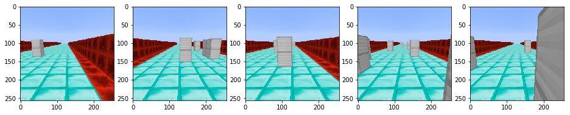
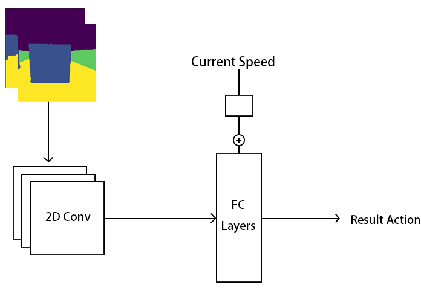

## Video

## Project Summary
In this project, we try to solve a sub-problem of the self-driving problem, which is automatic obstacle avoidance. We treat the main character “Steve” as a car. The agent can do the following action:
1. Accelerating forward speed
2. Reducing forward speed (braking)
3. Moving to the left horizontally
4. Moving to the right horizontally
5. Stop moving horizontally

We want our agent to drive as far as possible without hitting obstacles set on a road in a given period of time (30 seconds). The boundary of the road is surrounded by redstone wall, so the agent must make sure it drive on the road and avoid driving onto the shoulder. The size of the road is 9 by 150, and there are 22 pillars as obstacles on the road. You can see the details of the map from the figure below:

 
We want to develop our agent in a way similar to modern self-driving solutions. Therefore, we are using Deep Q-learning Network (DQN) with computer vision (image segmentation) to solve this problem. We also set the forward speed of our agent as a continuos variable to simulate the reality. Using machine learning algorithm is essential to solve this problem since in real world, it is very hard to get simple grid representation of roads, and the action space is continuos in the real world. Auto-driving agents can only get complex vision information and limited depth information from cameras and radars.

## Approaches

In this project, we use the following models to be baselines or to solve this problem:
1. Random model (baseline 1)
2. DQN without Segmentation Neural Network (SNN) (baseline 2)
3. DQN with SNN. Speed fixed (model in status report. baseline 3)
4. DQN with SNN and continuos speed. (final model)

#### **Random model**
As discussed above, our agent has 5 different actions described below:

|        |      0     |             1            |             2            |         3         |         4         |
|:------:|:----------:|:------------------------:|:------------------------:|:-----------------:|:-----------------:|
| Action | Do nothing/End moving horizontally | Horizontal velocity set to -0.25 | Horizontally velocity set to 0.25 | Forward speed +0.1 | Forward speed -0.1 |
{: .tablelines}

 
The Random model is a very simple baseline, it will only take action 1-5  randomly following a uniform distribution.

#### **DQN without SNN**

Our second baseline is a deep Q-learning network. The reinforcement learning part of this model is identical to our final model. The only difference between this model and the final model is that this model does not use SNN as a vision-preprocessing network. Since this model does not use SNN, it will have more reaction time than models with SNN because SNN is a relative large network, and requires much time to run. However, without SNN, the DQN must learn the representation of the image and the policy at the same time, which can be very hard. Also, since the learning of the DQN is based on a black box reward, the representation in convolutional layers might be very imprecise. The action of the model is defined [here](#random-model).  

**Network Structure**   

The network contains two parts. The first part is a series 2D convolutional layers with max pooling. They take the original game screen as the input. The second part is fully connected layers. They take the result from the convolutional layers, and the current speed as the input, and output the action.

**Reward Function**   
We want to define a non-sparse reward function. Therefore, we decide to use the current speed of the agent as the main reward. We use the 10 times of the speed subtracted from 1.6 to be the main reward. The reward will be negative if the speed is too slow. Also, we want to encourage our agent to avoid hitting pillars and do less meaningless actions. Therefore, we design the reward function as given below:

$$
R(s)=\left\{
\begin{aligned}
    &(S\times 10)-1.6 \ (\text{No action})\\
    &(S\times 10)-4.2 \ (\text{Any action is taken})\\
    &-75\ \ \ \ \ \ \ \ \ \ \ \ \ \ \ \ \ (\text{Collision happens})
\end{aligned}
\right.
$$

where $S$ indicates the forward speed, $S \in [0.1,0.8]$.  

**Loss Function**
  

The goal of Deep Q-learning is that instead of building a Q table, we want to find a Q function $Q$, and a policy $\pi$, so that $\pi(s)=\underset{s}{\mathrm{argmax}}(Q(s,a))$. $Q$ may be very complex, but according to universal approximation theorem, our network can fit the $Q$. Every epoch, we update the $Q$ by minimizing the loss function given below:

 

$$
    \delta = Q(s,a)-(r+\gamma \underset{a}{\mathrm{max}}(Q(s',a)))
$$

 

To train our model, we apply the Huber loss upon the $\delta$

$$
L(\delta)=\left\{
\begin{aligned}
    0.5\delta^2 &\ \ \ \text{if |$\delta$|<1}\\
    |\delta|-\frac{1}{2} &\ \ \ \text{Otherwise}\\ 
\end{aligned}
\right.
$$

 We are using Huber loss because it would make the loss not very sensitive to outliers and more stable. The performance of this model is not very good which is described in [evaluation](#evaluation).

#### **DQN with SNN (fixed forward speed)**

Instead of taking the original image as input directly, we can train another neural network to do the image segmentation. It is very hard for a DQN to learn image representation. However, it will be much easier if we add a neural network which only learns how to represent image. Therefore, in our status report, we present a model which combines DQN and segmentation neural network. We use this model as a baseline here, since it can only change the direction of strafing without changing the forward speed.  
In this model, the SNN is used as a sensor of our agent. The representation from SNN is more efficient than original image is because there are only 5 possible values and 1 channel in its output. The 5 values are:

|                | &nbsp;0         | &nbsp;1                                 | &nbsp;2           | &nbsp;3                 | &nbsp;4          |
| -------------- | --------------- | --------------------------------------- | ----------------- | ----------------------- | ---------------- |
| **Represents** | &nbsp;sky&nbsp; | &nbsp;pillars&nbsp;and&nbsp;walls&nbsp; | &nbsp;grass&nbsp; | &nbsp;shoulder and outline walls&nbsp; | &nbsp;road&nbsp; |
{: .tablelines}

 
This representation is much more efficient than the original images (3 channels with 256 values).
  

**Data Generation**  

Since the SNN is trained by using supervised learning. The most important problem is how to get the dataset with enough data. We developed an approach to generate data by ourselves. 
First, we generate $n$ random maps ($n=500$ in our case). Then, we replace the resource package of Minecraft to a pure color texture package made by ourselves(shown below) 

 
Then, we just scan the image pixel by pixel, and we set different threshold of RGB values for types of blocks. Then, we final dataset looks like as shown below:

Input Data

Ground Truth Labels
  

 

**Network Structure and Loss Function**
  
We are using one of the most popular network structure, [ResNet50](https://arxiv.org/abs/1512.03385), to do the segmentation. This network can achieve a very high accuracy ([See Evaluation](#evaluation)). We train the SNN by minimizing the pixel-wise cross entropy between the ground truth and our prediction. The pixel-wise cross entropy function is given below: 

 

$$
L(\pmb{y},\pmb{\hat{y}})=\sum_{i=0}^c p_ilog(q_i)
$$

We use Adam as the optimizer with learning rate = 0.0002, and trained only 10 epochs with batch size 4 under RTX 2080 graphics cards. After 10 epochs, the validation accuracy reached around 85%.
  
**DQN**
  
The DQN part of this model is almost identical to [DQN without SNN](dqn-without-snn). However, the action is defined as:

|        | 0                        | 1                      | 2                       |
| ------ | ------------------------ | ---------------------- | ----------------------- |
| Action | Stop moving horizontally | Move left horizontally | Move right horizontally |
{: .tablelines}

 
Also, the reward function is defined as:

$$
R(s)=\left\{
\begin{aligned}
    -75 &\ (\text{Collision happens})\\
    7.5 &\ (\text{No action})\\
    2.5 &\ (\text{Moving to the left or right})
\end{aligned}
\right.
$$

In this model, the forward speed is fixed at 0.35. When we increase this speed, the agent cannot adapt to the environment if there are obstacles because it cannot reduce its speed. The details can be found in [evaluation section](#evaluation).
 

#### **DQN with SNN and continuos speed**

By studying the models we discussed above, we are able to find the best model among the models we trained. First, SNN is critical to this problem, since the DQN should focus on learning the best policy instead of image representation. Also, variable forward speed is required since the agent should reduce its speed if the density of obstacles is high, and increase its speed if there are less obstacles in order to drive as far as possible. Therefore, we combined the [DQN without SNN](dqn-without-snn) and [DQN with SNN (fixed forward speed)](#dqn-with-snn-(#fixed-forward-speed)) to get our final model. The action space and reward function are identical to DQN without SNN, so we will focus on what is different in our final model.

**Network Structure**

Since now the forward speed is various. The agent needs more information about speed. Therefore, instead of feeding the model a single segmented image. We provide the model two channels of images. One is the current state, another is the previous state. The segmented images go through a series of CNN. The result of CNN would be computed by FC with numerical speed jointly. We are using SELU as the activation function except the last layer.

