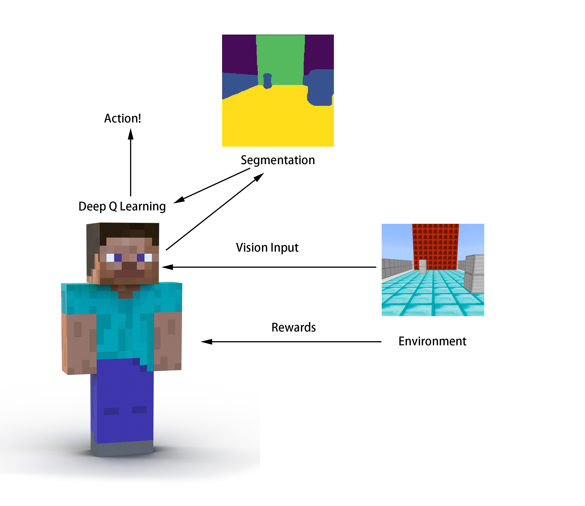

Welcome! 
The source code of our project can be found [here](https://github.com/ziyangz5/MinePilot/) ! 
Our status report is available [here](https://ziyangz5.github.io/MinePilot/status.html) !
You can also watch our demonstration [video](https://www.youtube.com/watch?v=GvRxhDbpNqQ)

# What is MinePilot?
Maybe you have noticed that there are many red honda cars around campus with very strange "desks" on the ceiling of the cars. Those are self-driving cars! The "desks" on the cars are video cameras and radars. Isn't that cool that self-driving cars have been already around with us? We are very interested in how those "magics" are implemented; therefore, our project is a simple implementation of self-driving algorithm, and we call our agent **MinePilot**!. Our agent is being set on a road with some obstacles, and it needs to avoid these walls to reach the destination. We use convolutional neural network to give the agent "vision." It can see the world, and distinguish which part of the input is road, and which part is wall. We then use the Deep Q-Learning algorithm to teach our agent when to go right, and when to go left to avoid hitting the obstacles or driving off the road. If you want to know more about our project you can watch this [video](https://www.youtube.com/watch?v=GvRxhDbpNqQ)! 

