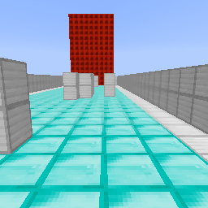
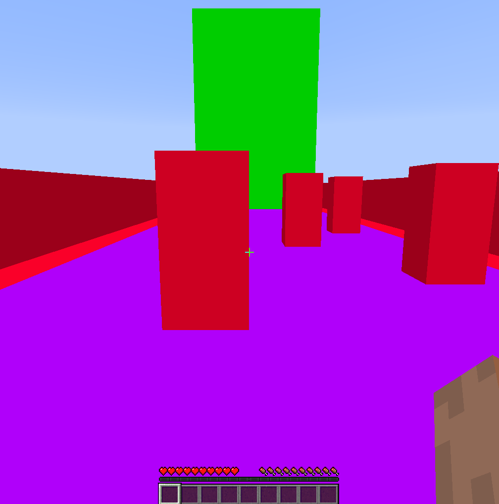
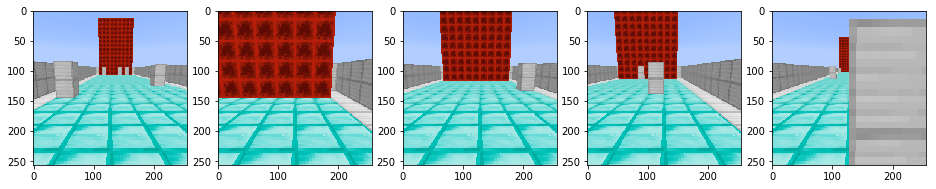
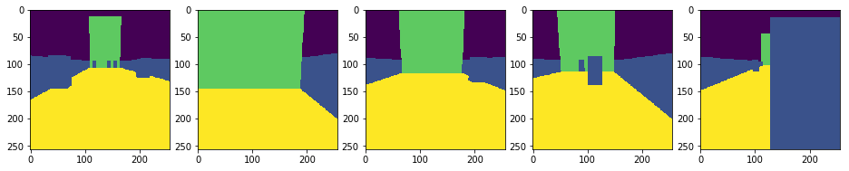
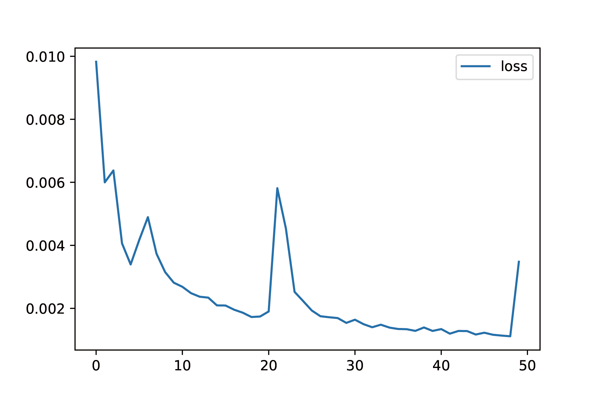
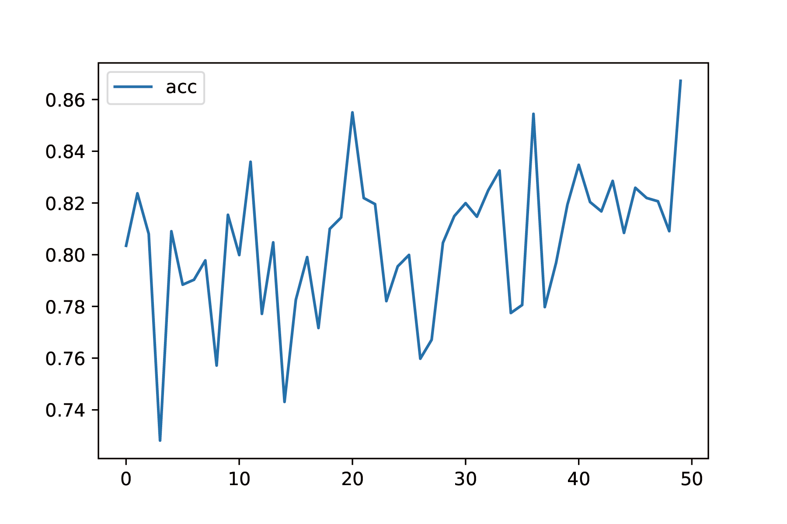
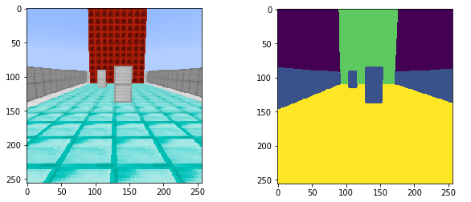
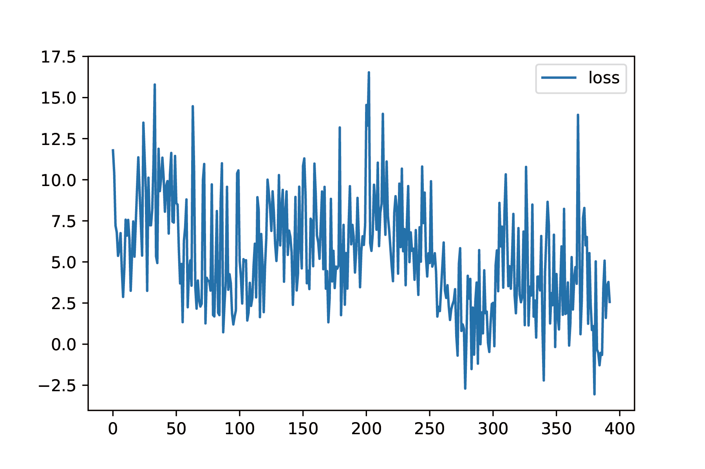
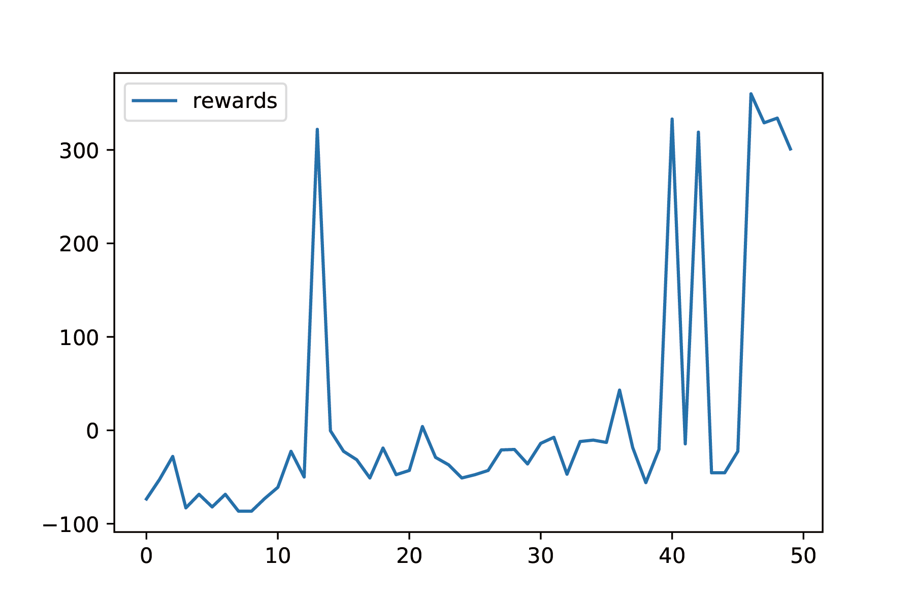
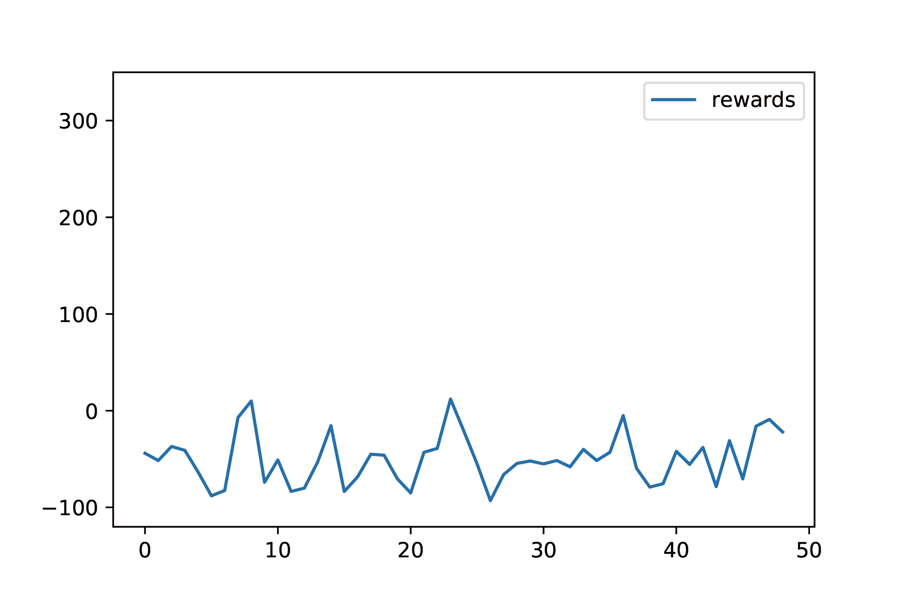

# Video

<iframe width="560" height="315" src="https://www.youtube.com/embed/GvRxhDbpNqQ" frameborder="0" allow="accelerometer; autoplay; encrypted-media; gyroscope; picture-in-picture" allowfullscreen></iframe>

# Summary
In this project, we try to solve a sub-problem of the self-driving problem, which is automatic obstacle avoidance. We s treat the main character “Steve” as a car. For now, it goes forward at a constant speed. At the same time, it can either horizontally move to right, or horizontal move to left, or just go straight. We want it to avoid all obstacles set on a road, and reach the destination. The destination is the red stone walls shown in the figure below. The size of the road is 9 by 30, and there are 9 pillars as obstacles on the road. On the edge of the road, there are two iron walls to detect if the agent drives off the road. You can see the details of the map from the figure below:

# Approach
We are using two main algorithm for this project:
1. Image Segmentation
2. Deep Q-learning 

We want the SNN (Segmentation Neural Network) to learn a very efficient representation of the input image ($256 \times 256$ pixels), and pass the output of SNN into the DQN (Deep Q Network). The reason why we are doing this is because we believe by using the high efficient representation from the SNN, DQN doesn't have to learn much image information representation in its CNN layers, which will improve the performance. (And this approach actually does improve the performance of the DQN, see this). 

## Segmentation Neural Network
The SNN is used as a sensor of our agent. The reason why the representation from SNN is more efficient is that there are only 5 possible values and 1 channel in its output. The 5 values are:

|                | &nbsp;0         | &nbsp;1                                 | &nbsp;2           | &nbsp;3                 | &nbsp;4          |
| -------------- | --------------- | --------------------------------------- | ----------------- | ----------------------- | ---------------- |
| **Represents** | &nbsp;sky&nbsp; | &nbsp;pillars&nbsp;and&nbsp;walls&nbsp; | &nbsp;grass&nbsp; | &nbsp;destination&nbsp; | &nbsp;road&nbsp; |
{: .tablelines}

 

This representation is much more efficient than the original images (3 channels with 256 values).
### Data Generation
Since the SNN is trained by using supervised learning. The most important problem is how to get the dataset with enough data. We developed an approach to generate data by ourselves. 
First, we generate $n$ random maps ($n=500$ in our case). Then, we replace the resource package of Minecraft to a pure color texture package made by ourselves(shown below) 

 
Then, we just scan the image pixel by pixel, and we set different threshold of RGB values for types of blocks. Then, we final dataset looks like as shown below:

Input Data

Ground Truth Labels
  

### Network Structure and Loss Function
We are using one of the most popular network structure, [ResNet50](https://arxiv.org/abs/1512.03385), to do the segmentation. This network can achieve a very high accuracy ([See Evaluation](#Evaluation)). We train the SNN by minimizing the pixel-wise cross entropy between the ground truth and our prediction. The pixel-wise cross entropy function is given below: 

 

$$
L(\pmb{y},\pmb{\hat{y}})=\sum_{i=0}^c p_ilog(q_i)
$$

We use Adam as the optimizer with learning rate = 0.0002, and trained only 10 epochs with batch size 4 under RTX 2080 graphics cards. After 10 epochs, the validation accuracy reached around 85%.

## Deep Q Network

### Actions
Once got the segmentation from the SNN, our DQN needs to decide the action of agent. For now, our agent only does discrete actions. The actions can be:

|        | 0                        | 1                      | 2                       |
| ------ | ------------------------ | ---------------------- | ----------------------- |
| Action | Stop moving horizontally | Move left horizontally | Move right horizontally |
{: .tablelines}

### Reward Function
We originally defined that the agent receives 200 points after reaching the destination, and receives -75 points after hitting the obstacles or going off the road. However, we found this reward function is very sparse. The agent may not be able to reach the destination for a very long time. Therefore, to encourage our agent to live longer and do less meaningless action, our reward function is defined as:

$$
R(s)=\left\{
\begin{aligned}
    250 &\ (\text{Agent reaches destination})\\
    -75 &\ (\text{Collision happens})\\
    7.5 &\ (\text{No action})\\
    2.5 &\ (\text{Moving to the left or right})
\end{aligned}
\right.
$$

### Loss function and training
The goal of Deep Q-learning is that instead of building a Q table, we want to find a Q function $Q$, and a policy $\pi$, so that $\pi(s)=\underset{s}{\mathrm{argmax}}(Q(s,a))$. $Q$ may be very complex, but according to universal approximation theorem, our network can fit the $Q$. Every epoch, we update the $Q$ by minimizing the loss function given below:

 

$$
    \delta = Q(s,a)-(r+\gamma \underset{a}{\mathrm{max}}(Q(s',a)))
$$

 

To train our model, we apply the Huber loss upon the $\delta$

$$
L(\delta)=\left\{
\begin{aligned}
    0.5\delta^2 &\ \ \ \text{if |$\delta$|<1}\\
    |\delta|-\frac{1}{2} &\ \ \ \text{Otherwise}\\ 
\end{aligned}
\right.
$$

 We are using Huber loss because it would make the loss not very sensitive to outliers, and there might be some outliers in our context setting (see [Challenges](#remaining-goals-and-challenges)). 
 Then, we set our replay memory of DQN to 15000, and use Adam as our optimizer with learning rate = 0.0005. We set our $\gamma$ to $0.98$, and the $\epsilon$ is decreasing from $0.88$ to $0.05$.  
 We used curriculum learning to help our policy converge. We first trained our agent on 7x10 maps with one pillar for 30 epochs, and then trained our agent on 7x20 maps with four pillars for 30 epochs. Finally, we put our agent in a 9x30 map with seven walls for 50 epochs. The performance of our agent can be found in our demo video.

# Evaluation
## Segmentation Neural Network

For the SNN, we mainly look into two types of metrics: pixel-wise cross entropy loss, and pixel-wise accuracy. 
We trained our for 50 epochs, and we find that the loss converged nicely:

We also tracked the pixel-wise accuracy given by $a=\frac{1}{mn}\sum_{i=0}^n\sum_{j=0}(y_{ij}==\hat{y}_{ij})$. The validation accuracy is a little bit noisy but it is increasing, and reached $86\%$ which is good enough for us.

You can also visually see that the performance of SNN is good:

## Deep Q Network

For DQN, we look at two metrics: how [rewards](#reward-function) change, and how [loss](#loss-function-and-training). 
The loss function is very noisy, and it is normal in reinforcement learning since black box $R$ cannot lead the gradient of loss function to decrease very well. However, it is still decreasing.

The change of rewards is very discrete, but in general it is increasing. Before 30 epochs, most of the rewards are below zero, and after 30 epochs, many rewards are very closet to 0. Also, after 40 epochs, the agent reaches the destination 5 times, and it reaches the destination 3 times continuously. We saved one of the parameters, and its performance can be found in our demo video.

Compare with our current model, we also train a naive DQN without SNN providing the segmentation. We train it in the same way as we train our DQN with SNN, but the performance of naive DQN is not good. The agent of naive DQN never reaches the destination. The plot below is the rewards of the naive DQN:

# Remaining Goals and Challenges
## Problem for now
We have two major problems now. The first one is the running time of SNN is too slow now. We want to give our agent more reaction time to let the agent move faster. Therefore, in our final project, we need to replace the ResNet50 to some smaller network structure without hurting much of the accuracy. 
Also, our reward function is not smooth enough. We need to find a more reasonable reward function to measure our agent's performance. The current rewards function is still pretty sparse.
## Goals and Challenges:
The first goal of our final project is to let our agent drive on a larger maps with more obstacles. Then, the biggest goal of our AI is to simulate continuous action. We think we can try to implement discretized continuous action because it is more feasible. Our new actions would be:

|        |      0     |             1            |             2            |         3         |         4         |
|:------:|:----------:|:------------------------:|:------------------------:|:-----------------:|:-----------------:|
| Action | Do nothing | Horizontal velocity -0.1 | Horizontal velocity +0.1 | Forward speed +0.1 | Forward speed -0.1 |
{: .tablelines}
 
This one is very challenging because continuous action is a very frontier topic of reinforcement learning. With our current model, I think it would be impossible to do it. However, we have two ideas about how to achieve it. The first one is we can try some different RL models, such as Actor-Critic model, and Deep Deterministic Policy Gradients  (DDPG). Especially for the DDPG, because it is designed for continuos action. Also, we want to implement imitation learning to improve our agent's performance.

# Resources Used
We have used Python Malmo module to simulate the car driving environment and to operate the Minecraft agent. We use PyTorch library to train our agent to avoid obstacles. 
The implementation of our DQN take [this](https://pytorch.org/tutorials/intermediate/reinforcement_q_learning.html) as a reference.